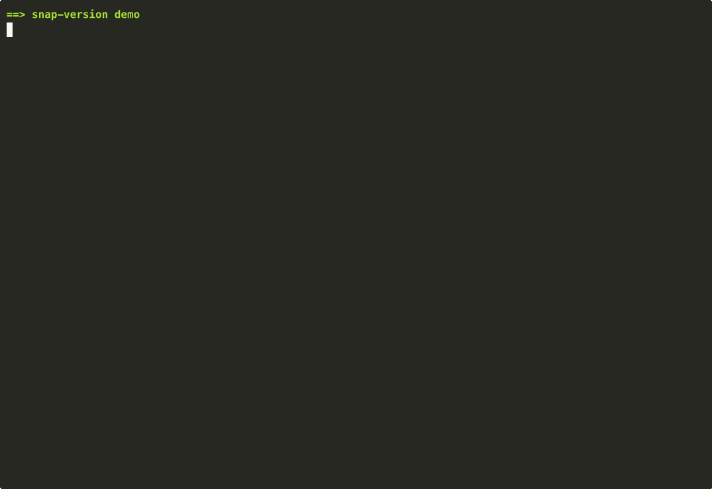

# snap-version

[](https://github.com/AndreKurait/snap-version/actions/workflows/ci.yml)
[](https://github.com/AndreKurait/snap-version/releases)
[](LICENSE)

**Edit the recorded version inside an OpenSearch / Elasticsearch S3 snapshot
so a lower-version cluster can restore it.**

OpenSearch and Elasticsearch refuse to restore a snapshot taken on a
higher version (`"the snapshot was created with OpenSearch version [2.19.4]
which is higher than the version of this node [2.19.0]"`). `snap-version`
reads the snapshot's metadata blobs (Smile + Lucene CodecUtil framing,
optional DEFLATE compression, CRC32 footer), rewrites the version fields,
and writes the bytes back so the target cluster accepts them.



## Why does this exist?

OpenSearch / Elasticsearch repository metadata records the snapshot's source
version in two places:

| File | Field | Format |
|---|---|---|
| `index-N` (plain JSON manifest) | `snapshots[].version` | string `"2.19.4"` |
| `snap-<uuid>.dat` (Smile + codec) | `snapshot.version_id` | XOR-encoded int |

If the target cluster has an older version, both checks fail and the restore
is rejected. `snap-version` decodes the Smile-encoded blob through the same
Lucene `CodecUtil` frame that ES/OS use, rewrites the integer, recomputes the
CRC32 footer, and uploads the corrected bytes — so the target cluster sees a
snapshot that thinks it was taken on its own version.

## Install

### From a release archive (any OS with Java 21+)

```bash
curl -L -o snap-version.tar https://github.com/AndreKurait/snap-version/releases/latest/download/snap-version.tar
tar -xf snap-version.tar
./snap-version-*/bin/snap-version --help
```

### From source

```bash
git clone https://github.com/AndreKurait/snap-version
cd snap-version
./gradlew installDist
build/install/snap-version/bin/snap-version --help
```

Java 21+ required (Temurin recommended). Same archive works on Linux x64/arm64,
macOS arm64/x64, and Windows x64 (use `bin/snap-version.bat` on Windows).

## Quick start

```bash
# Inventory: print every snapshot in the repo and its recorded version
snap-version version --repo s3://my-bucket/snapshots --profile prod-readwrite --show

# Downgrade every snapshot to 2.19.0
snap-version version --repo s3://my-bucket/snapshots --profile prod-readwrite --to 2.19.0 --yes

# Or run interactively (no --to flag) — prints inventory, prompts for target + confirm
snap-version version --repo s3://my-bucket/snapshots --profile prod-readwrite

# Local directory works too (e.g. an `aws s3 sync`'d copy)
snap-version version --repo /var/snapshots/movies-repo --to 2.19.0 --yes
```

`--profile` uses your `~/.aws/credentials` like the AWS CLI. For MinIO /
LocalStack: add `--endpoint http://localhost:9000 --access-key X --secret-key Y --path-style`.

## Subcommands

| Command | What it does |
|---|---|
| `version` | Inventory + rewrite snapshot versions in one command. **The main entry point.** |
| `tui` | Interactive two-pane terminal UI (browse blobs, edit JSON, Ctrl-S to save). |
| `ls` | Print snapshots and indices from the repo manifest. |
| `cat` | Decode a metadata blob (Smile + codec frame) and print as JSON. |
| `pull` / `push` | Download a blob to a local JSON file / re-encode and upload it. |
| `edit` | Pull → open in `$EDITOR` → re-encode and upload. |
| `decode-file` / `encode-file` | Offline blob-on-disk decode/encode (no S3 needed). |

Run `snap-version <command> --help` for full options.

## How it works

```
                                                      writes back
                ┌───────────────────────┐    Smile + codec frame    ┌──────────────────┐
                │  S3 / MinIO / LocalFS │ ◄──────────────────────── │  snap-version    │
                │                       │                           │  + new CRC32     │
                │  index-N (JSON)       │ ────────────────────────► │                  │
                │  snap-<uuid>.dat      │   reads + decodes Smile   │  rewrites the    │
                │  (Smile + codec)      │                           │  version fields  │
                └───────────────────────┘                           └──────────────────┘
```

Concretely, `version --to <NEW>` does:

1. Read `index.latest` → generation N.
2. Parse `index-N` (plain JSON).
3. For every snapshot, fetch and decode `snap-<uuid>.dat` (strip Lucene
   CodecUtil header → optionally inflate `DFL\0`+raw-DEFLATE → parse Smile)
   to read `version_id`.
4. Rewrite `snapshots[*].version` (and `version_id` if present) in `index-N`,
   upload.
5. For each selected snapshot, decode the Smile body, set
   `snapshot.version_id = (major*1_000_000 + minor*10_000 + revision*100 + 99) ^ 0x08000000`,
   re-encode Smile, re-wrap with codec header, recompute CRC32, upload.

Shard-data files (`__*` blobs), shard-level snap files, index metadata, and
data are not touched.

## Tests

```bash
./gradlew test       # unit + CLI tests, no Docker needed (~10s)
./gradlew e2eTest    # full e2e: real OpenSearch + MinIO via testcontainers
```

The e2e suite (`SnapshotDowngradeE2ETest`) spins up OpenSearch 2.19.4 (source)
and 2.19.0 (target) on a docker network with MinIO as S3, asserts the target
**rejects** the unmodified snapshot (HTTP 500), runs `VersionRewriter`, then
asserts the target **accepts** the rewritten snapshot (HTTP 200) and queries
return all the original documents.

| Suite | Tests | Highlights |
|---|---|---|
| `MetadataCodecTest` | 5 | Codec frame round-trip, DFL\0 detection, bad-CRC + bad-codec rejection |
| `SmileJsonTest` | 1 | Smile↔JSON with the ES-matching factory |
| `VersionCodecTest` | 5 | `version_id` encoding for known versions; legacy ES decoding |
| `LocalStoreTest` | 4 | Local filesystem store: round-trip + path-traversal blocked |
| `VersionRewriterTest` | 4 | Rewrite all / selected / no-op idempotency |
| `CliE2ETest` | 7 | **Drives the actual CLI in-process — read this for usage examples.** |
| `SnapshotDowngradeE2ETest` (e2e) | 1 | Real cluster pair via testcontainers — the whole point |
| `DockerClientProbeTest` (e2e) | 1 | Sanity: testcontainers can find the docker daemon |

## Recording the demo

If you want to re-record the GIF at the top of this README:

```bash
brew install asciinema agg          # one-time
docker compose -f docker/docker-compose.yml up -d --wait
./gradlew installDist
./demo/record.sh                    # writes demo/demo.cast and demo/demo.gif
```

## Compatibility

Tested against OpenSearch 2.x snapshots (post-shard-generations layout).
ES 1.x / 2.x / 5.x / 6.x metadata is also Smile-encoded but with slightly
different `index-N` shapes — the codec layer here will read those, but the
high-level `version` command's expectations may need tweaks. PRs welcome.

Snapshot blobs that pre-date version-id-as-XOR (legacy Elasticsearch) are
auto-detected by the absence of the `0x08000000` mask bit; `version --show`
will display them but `--to <version>` writes the OpenSearch encoding by
default.

## Contributing

See [CONTRIBUTING.md](CONTRIBUTING.md). Short version: small, focused PRs;
add a test in `CliE2ETest` if you change CLI behavior; run `./gradlew test e2eTest`
locally before pushing.

## License

[Apache-2.0](LICENSE)
